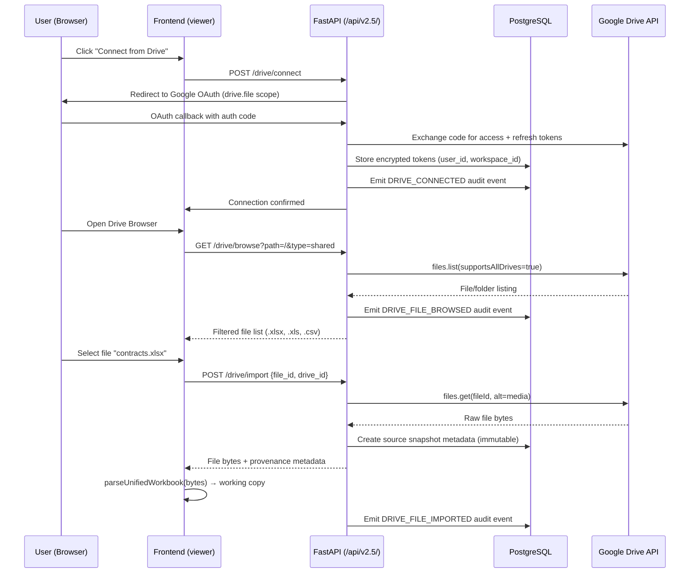
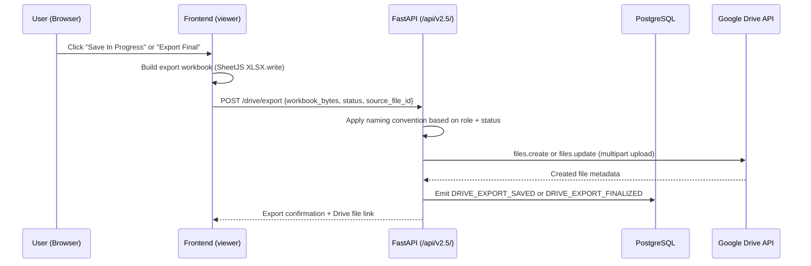
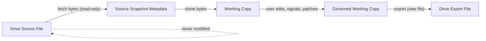

# V2.5 Feature Specification: Google Drive Integration

**Version:** 2.5.0-draft
**Date:** 2026-02-13
**Status:** Gate 1 — Specification Only (No Code)
**Author:** Orchestrate OS Architecture Team

---

## 1. Feature Overview

Google Drive becomes a first-class data source in Orchestrate OS for importing contract workbooks and exporting governed artifacts. This integration extends the existing local file upload pipeline (`handleExcelUpload()` → `parseUnifiedWorkbook()`) to support Drive-hosted `.xlsx`, `.xls`, and `.csv` files while preserving all governance semantics — signals, triage, patches, RFIs, audit events, and RBAC enforcement.

### Goals

| Goal | Description |
|------|-------------|
| **Import from Drive** | Users browse and select files from My Drive or Shared Drives; the server fetches file bytes and feeds them into the existing workbook parsing pipeline |
| **Export to Drive** | Users save in-progress or finalized workbooks back to Drive with status-based naming conventions |
| **Immutable provenance** | Every import creates a source snapshot with full provenance metadata; the original Drive file is never modified |
| **Audit coverage** | Every Drive action (connect, disconnect, browse, import, export) emits an append-only audit event |
| **Scope separation** | Drive OAuth is fully separate from login OAuth — different scopes, different consent screens, different token lifecycle |

### Non-Goals (This Phase)

See [Section 10: Explicit Out-of-Scope List](#10-explicit-out-of-scope-list) for a complete enumeration.

---

## 2. Architecture Flow

### 2.1 Sequence Overview

```
User clicks "Connect from Drive" → Google OAuth (Drive scope) → Token stored server-side
→ Drive Browser UI (shared drives, folders, files) → User selects .xlsx/.xls/.csv file
→ Server fetches file bytes from Drive API → Creates immutable source snapshot metadata
→ Passes bytes to existing parseUnifiedWorkbook pipeline (working copy)
→ User works on data (signals, triage, patches, RFIs)
→ User clicks "Save In Progress" or "Export Final"
→ Server writes file back to Drive with status-based naming convention
→ Audit event emitted for every Drive action
```

### 2.2 Mermaid Diagram — Import Flow



### 2.3 Mermaid Diagram — Export Flow



### 2.4 Component Integration Map

```mermaid
graph TD
    subgraph Browser
        A[Drive Browser UI] --> B[File Selector]
        B --> C[handleExcelUpload - existing]
        C --> D[parseUnifiedWorkbook - existing]
        D --> E[Working Copy / Session]
        E --> F[Signals + Triage Pipeline]
        E --> G[Export Builder - SheetJS]
    end

    subgraph Server
        H[/drive/connect] --> I[OAuth Token Manager]
        J[/drive/browse] --> K[Drive API Client]
        L[/drive/import] --> K
        L --> M[Source Snapshot Store]
        N[/drive/export] --> K
        N --> O[Naming Convention Engine]
        P[Audit Event Emitter]
    end

    subgraph External
        Q[Google Drive API v3]
        R[Google OAuth 2.0]
    end

    A -->|browse request| J
    B -->|import request| L
    G -->|export request| N
    H --> R
    K --> Q
    I --> R
    H --> P
    J --> P
    L --> P
    N --> P
```

---

## 3. Security / Scopes Policy

### 3.1 OAuth Scope Strategy

| Scope | URI | Use Case | When Requested |
|-------|-----|----------|----------------|
| **drive.file** | `https://www.googleapis.com/auth/drive.file` | Read/write files created or opened by the app | Default — least privilege |
| **drive.readonly** | `https://www.googleapis.com/auth/drive.readonly` | Read any file the user can access | Only if user needs to browse files not previously opened by the app |

**Default scope:** `drive.file` — this limits access to only files that the user explicitly opens through Orchestrate OS or that the app creates. This is the least-privilege option.

**Upgrade path:** If the user needs to browse and import files that were not created by the app, the system requests `drive.readonly` via incremental authorization. The user sees a separate consent screen.

### 3.2 Scope Separation from Login OAuth

| Concern | Login OAuth | Drive OAuth |
|---------|------------|-------------|
| **Purpose** | User identity (OIDC) | File access |
| **Scopes** | `openid email profile` | `drive.file` or `drive.readonly` |
| **Consent screen** | Shown at login | Shown when user clicks "Connect from Drive" |
| **Token storage** | JWT session (24hr expiry) | Server-side encrypted token record |
| **Token lifetime** | Session-bound | Persistent until revoked |
| **Revocation** | Logout clears session | DELETE `/drive/disconnect` revokes Drive token |

### 3.3 Token Storage

- Drive OAuth tokens (access + refresh) are stored **server-side only** in the `drive_connections` database table
- Tokens are encrypted at rest if the deployment environment supports column-level encryption; otherwise stored in a non-public schema with strict access controls
- **Never stored in browser localStorage, sessionStorage, or IndexedDB**
- Token association: `(user_id, workspace_id)` — one Drive connection per user per workspace
- Refresh tokens are used to obtain new access tokens transparently; the client never sees raw Drive tokens

### 3.4 Token Refresh Handling

1. On every Drive API call, the server checks if the access token is expired
2. If expired, the server uses the stored refresh token to obtain a new access token from Google
3. The new access token is stored; the refresh token is rotated if Google issues a new one
4. If the refresh token is revoked or invalid, the server marks the connection as `disconnected` and returns a `DRIVE_RECONNECT_REQUIRED` error to the client
5. The client prompts the user to re-authorize via the "Connect from Drive" flow

### 3.5 Security Constraints

| Constraint | Enforcement |
|------------|-------------|
| No browser-side token storage | Server never returns raw tokens to the client |
| Workspace-scoped connections | Drive tokens are bound to `(user_id, workspace_id)` |
| Audit trail on all Drive operations | Every Drive API call emits an audit event before returning |
| Token revocation on disconnect | DELETE `/drive/disconnect` calls Google's revoke endpoint |
| No implicit scope escalation | `drive.readonly` requires explicit incremental consent |

---

## 4. Shared Drive Handling

### 4.1 Drive Types

| Drive Type | API Parameter | Description |
|------------|---------------|-------------|
| **My Drive** | `corpora=user` | User's personal Drive |
| **Shared Drive** | `corpora=allDrives`, `supportsAllDrives=true`, `includeItemsFromAllDrives=true` | Organization shared drives |

### 4.2 Browse Behavior

- The Drive Browser UI displays a two-level root:
  - **My Drive** — user's personal files
  - **Shared Drives** — list of shared drives the user has access to
- Folder navigation with breadcrumb trail (e.g., `Shared Drives > CMG Contracts > Q1 2026`)
- All `files.list` calls include `supportsAllDrives=true` to ensure shared drive files are accessible

### 4.3 File Filtering

Only files matching the following MIME types and extensions are shown in the browser:

| Extension | MIME Type |
|-----------|-----------|
| `.xlsx` | `application/vnd.openxmlformats-officedocument.spreadsheetml.sheet` |
| `.xls` | `application/vnd.ms-excel` |
| `.csv` | `text/csv` |

The API query uses:
```
mimeType = 'application/vnd.openxmlformats-officedocument.spreadsheetml.sheet'
or mimeType = 'application/vnd.ms-excel'
or mimeType = 'text/csv'
or mimeType = 'application/vnd.google-apps.folder'
```

Folders are always shown for navigation; only supported file types are selectable for import.

### 4.4 Browse API Parameters

| Parameter | Value | Purpose |
|-----------|-------|---------|
| `supportsAllDrives` | `true` | Enable shared drive access |
| `includeItemsFromAllDrives` | `true` | Include shared drive items in results |
| `corpora` | `allDrives` | Search across all accessible drives |
| `fields` | `files(id,name,mimeType,modifiedTime,size,driveId,parents)` | Limit response fields |
| `q` | MIME type filter + parent folder filter | Constrain results |
| `orderBy` | `name` | Alphabetical sorting |
| `pageSize` | `100` | Pagination limit per request |

---

## 5. Naming Convention Rules for Export

### 5.1 Status-Based File Naming

When exporting a working copy back to Drive, the file is named using a status prefix derived from the current governance state and the actor's role.

| Prefix | Condition | Role Required |
|--------|-----------|---------------|
| `[IN_PROGRESS-ANALYST]` | Analyst saves in-progress work | Analyst |
| `[ANALYST_DONE]` | Analyst marks work as complete | Analyst |
| `[VERIFIER_DONE]` | Verifier has approved all patches | Verifier |
| `[ADMIN_FINAL]` | Admin has signed off on the workbook | Admin |
| `[REJECTED]` | Workbook rejected at any gate | Verifier or Admin |

### 5.2 Naming Format

```
[STATUS_PREFIX] original_filename.xlsx
```

**Examples:**
- `[IN_PROGRESS-ANALYST] Ostereo Distribution Agreement.xlsx`
- `[ANALYST_DONE] Ostereo Distribution Agreement.xlsx`
- `[VERIFIER_DONE] Ostereo Distribution Agreement.xlsx`
- `[ADMIN_FINAL] Ostereo Distribution Agreement.xlsx`
- `[REJECTED] Ostereo Distribution Agreement.xlsx`

### 5.3 Export Placement

- Exports are written to the **same folder** as the source file by default
- If the source file was in a shared drive, the export goes to the same shared drive folder
- The original source file is **never overwritten** — exports create new files
- The export file's description field includes the Orchestrate OS batch ID and export timestamp

---

## 6. Color/Style Export Parity Requirement

### 6.1 Style Preservation Goals

Exported workbooks must faithfully reproduce the visual formatting of the working copy, including:

| Style Property | Preservation Required | Notes |
|----------------|----------------------|-------|
| Cell background color | Yes | Including red-cell highlighting |
| Font color | Yes | |
| Font weight (bold) | Yes | |
| Font style (italic) | Yes | |
| Number formatting | Yes | Currency, percentages, dates |
| Column widths | Yes | |
| Row heights | Best effort | |
| Merged cells | Yes | |
| Borders | Yes | |
| Conditional formatting rules | No | SheetJS limitation |

### 6.2 Red-Cell Highlighting Preservation

- Cells highlighted red by external sources (e.g., CMG internal tools) must retain their red background on re-export
- The system tracks which cells had pre-existing red highlighting via the provenance metadata flag `has_external_modifications: true`
- Orchestrate OS's own red-cell annotations (from signals, triage flags) are also preserved

### 6.3 SheetJS Limitations

| Limitation | Impact | Mitigation |
|------------|--------|------------|
| `xlsx` package (community) does not support writing styles | Critical | Use `xlsx-style` fork or `SheetJS Pro` for style-aware export |
| Conditional formatting rules are not preserved | Low | Document as known limitation; static cell colors are preserved |
| Chart objects are dropped on re-export | Low | Contracts workbooks typically do not contain charts |
| VBA macros are stripped | Low | `.xlsm` files are imported as data-only |

---

## 7. Red-Cell Acceptance Behavior

### 7.1 Import Handling

When a file is imported from Drive (or local upload) that contains pre-existing red-highlighted cells:

1. The system **accepts the file** without error
2. Red cells are parsed and rendered in the working copy grid
3. The provenance metadata is flagged with `has_external_modifications: true`
4. No automatic patch reconstruction is attempted from external red cells

### 7.2 Provenance Metadata Flags

| Flag | Type | Description |
|------|------|-------------|
| `has_external_modifications` | `boolean` | `true` if the imported file contains red-highlighted cells not originating from Orchestrate OS |
| `baseline_unknown` | `boolean` | `true` if no prior baseline exists in the system for this file; the imported version becomes the initial baseline |

### 7.3 Explicit Non-Behavior

The following behaviors are **explicitly out of scope** for red-cell handling:

- **No forced patch reconstruction:** The system does not attempt to infer what changed based on red cells. Red cells from external sources are visual-only markers.
- **No automatic triage generation:** External red cells do not trigger triage items or signals unless the user manually initiates review.
- **No diff against unknown baseline:** If `baseline_unknown: true`, the system does not attempt to compute a diff. The entire file is treated as the new baseline.

---

## 8. Major Changes Log

### 8.1 Changes Log Artifact

Every export package includes a **changes log** — a structured artifact documenting all governance actions performed on the working copy since import.

### 8.2 Tracked Events

| Event Category | Specific Events |
|----------------|-----------------|
| **Field edits** | Field value changed (before/after), field verified, field corrected |
| **RFI activity** | RFI created, RFI responded, RFI closed |
| **Patch lifecycle** | Patch submitted, approved (verifier), approved (admin), rejected, cancelled, applied |
| **Signal changes** | Signal created, signal resolved, signal severity changed |
| **Triage activity** | Triage item created, resolved, dismissed |

### 8.3 Changes Log Format

The changes log is included as an additional sheet in the exported workbook named `_OOS_Changes_Log` with columns:

| Column | Description |
|--------|-------------|
| `Timestamp` | ISO-8601 timestamp of the event |
| `Event Type` | Audit event type (e.g., `PATCH_SUBMITTED`) |
| `Actor` | Display name of the user who performed the action |
| `Role` | Actor's role at the time of the action |
| `Record ID` | Affected record identifier |
| `Field` | Affected field key (if applicable) |
| `Before Value` | Previous value (if applicable) |
| `After Value` | New value (if applicable) |
| `Notes` | Additional context (RFI question, patch intent, etc.) |

---

## 9. Working Copy Model

### 9.1 Immutable Source Principle

**Import always creates a working copy; the source file on Drive is never modified.**



### 9.2 Provenance Metadata Schema

Every Drive import creates a provenance record with the following fields:

| Field | Type | Description |
|-------|------|-------------|
| `source_type` | `string` | `"google_drive"` |
| `source_file_id` | `string` | Google Drive file ID |
| `source_drive_id` | `string | null` | Shared drive ID (null for My Drive) |
| `source_version` | `string` | Drive file version number at time of import |
| `source_file_name` | `string` | Original file name on Drive |
| `source_mime_type` | `string` | MIME type of the source file |
| `source_modified_time` | `ISO-8601` | Last modified time on Drive at import |
| `source_size_bytes` | `integer` | File size in bytes |
| `imported_at` | `ISO-8601` | Timestamp of import into Orchestrate OS |
| `imported_by` | `string` | User ID (`usr_`) of the importer |
| `has_external_modifications` | `boolean` | Whether red-highlighted cells were detected |
| `baseline_unknown` | `boolean` | Whether a prior baseline exists in the system |
| `workspace_id` | `string` | Workspace ID (`ws_`) |
| `batch_id` | `string` | Batch ID (`bat_`) created for this import |

### 9.3 Working Copy Lifecycle

The working copy follows the **same lifecycle as a local upload**:

1. **Import** → Source snapshot + working copy created
2. **Parse** → `parseUnifiedWorkbook()` processes bytes into session
3. **Govern** → Signals, triage, patches, RFIs applied
4. **Export** → Working copy exported to Drive as a new file with status prefix
5. **Archive** → Batch archived when governance cycle completes

The only difference from local upload is:
- The source is fetched from Drive API instead of a browser file input
- Provenance metadata includes Drive-specific fields
- Export writes to Drive instead of triggering a browser download

---

## 10. Explicit Out-of-Scope List

The following capabilities are **explicitly excluded** from this phase of Drive integration:

| # | Feature | Reason |
|---|---------|--------|
| OS-1 | Auto-refresh / polling for Drive changes | Manual import only; real-time sync adds complexity without immediate governance value |
| OS-2 | Patch backfill from external red cells | Red cells from external sources are visual markers only; no inference of change intent |
| OS-3 | Multi-file batch import from Drive in single action | Single file import per action; batch import is a future phase feature |
| OS-4 | Google Sheets native editing | Only file download/upload via Drive API; no Sheets API integration |
| OS-5 | Drive webhook / push notifications | No `changes.watch` or push notification channels; polling is manual |
| OS-6 | Conflict resolution between Drive version and local working copy | If the Drive file changes after import, the system does not detect or resolve conflicts |
| OS-7 | Admin configuration of Drive folder mapping per workspace | No admin UI for mapping specific Drive folders to workspaces |
| OS-8 | Batch export of multiple workbooks to Drive | Single workbook export per action |
| OS-9 | Drive file versioning / history browsing | Only the current version is imported; no version history UI |
| OS-10 | Offline Drive access | Drive operations require server connectivity |

---

## 11. API Endpoints (Preview)

All endpoints are under `/api/v2.5/` and require authentication via Bearer JWT.

### 11.1 Endpoint Catalog

| Method | Path | Description | Auth Required | Min Role |
|--------|------|-------------|---------------|----------|
| POST | `/drive/connect` | Initiate Drive OAuth flow; returns redirect URL | Yes | Admin |
| GET | `/drive/connect/callback` | OAuth callback handler (internal) | System | — |
| DELETE | `/drive/disconnect` | Revoke Drive access and delete stored tokens | Yes | Admin |
| GET | `/drive/status` | Check current Drive connection state | Yes | Any |
| GET | `/drive/browse` | List drives, folders, and files | Yes | Any |
| POST | `/drive/import` | Import a file from Drive into a new batch | Yes | Any |
| POST | `/drive/export` | Export a working copy back to Drive | Yes | Role-based |

### 11.2 Endpoint Details

#### POST `/drive/connect`

Initiates the Google OAuth flow for Drive access.

**Request Body:**
```json
{
  "workspace_id": "ws_...",
  "scope": "drive.file"
}
```

**Response (200):**
```json
{
  "data": {
    "redirect_url": "https://accounts.google.com/o/oauth2/v2/auth?...",
    "state": "encrypted_state_token"
  }
}
```

#### DELETE `/drive/disconnect`

Revokes the user's Drive access token and removes stored credentials.

**Query Parameters:** `workspace_id=ws_...`

**Response (200):**
```json
{
  "data": {
    "disconnected": true,
    "revoked_at": "2026-02-13T00:00:00Z"
  }
}
```

#### GET `/drive/status`

Returns the current Drive connection status for the authenticated user.

**Query Parameters:** `workspace_id=ws_...`

**Response (200):**
```json
{
  "data": {
    "connected": true,
    "scope": "drive.file",
    "connected_at": "2026-02-13T00:00:00Z",
    "drive_email": "user@createmusicgroup.com"
  }
}
```

#### GET `/drive/browse`

Lists files and folders from the user's connected Drive.

**Query Parameters:**

| Parameter | Type | Required | Default | Description |
|-----------|------|----------|---------|-------------|
| `workspace_id` | string | Yes | — | Workspace scope |
| `parent_id` | string | No | `root` | Folder ID to list contents of |
| `drive_id` | string | No | — | Shared drive ID (omit for My Drive) |
| `page_token` | string | No | — | Pagination token |

**Response (200):**
```json
{
  "data": {
    "items": [
      {
        "id": "1abc...",
        "name": "Q1 Contracts",
        "mime_type": "application/vnd.google-apps.folder",
        "type": "folder",
        "modified_time": "2026-02-10T12:00:00Z"
      },
      {
        "id": "2def...",
        "name": "Ostereo Distribution.xlsx",
        "mime_type": "application/vnd.openxmlformats-officedocument.spreadsheetml.sheet",
        "type": "file",
        "size_bytes": 245760,
        "modified_time": "2026-02-12T15:30:00Z"
      }
    ],
    "breadcrumb": [
      {"id": "root", "name": "My Drive"},
      {"id": "1abc...", "name": "Q1 Contracts"}
    ],
    "next_page_token": "eyJ...",
    "drive_type": "my_drive"
  }
}
```

#### POST `/drive/import`

Imports a file from Drive into a new batch.

**Request Body:**
```json
{
  "workspace_id": "ws_...",
  "file_id": "2def...",
  "drive_id": null
}
```

**Response (200):**
```json
{
  "data": {
    "batch_id": "bat_...",
    "file_bytes_base64": "UEsDBBQ...",
    "provenance": {
      "source_type": "google_drive",
      "source_file_id": "2def...",
      "source_drive_id": null,
      "source_version": "42",
      "source_file_name": "Ostereo Distribution.xlsx",
      "source_mime_type": "application/vnd.openxmlformats-officedocument.spreadsheetml.sheet",
      "source_modified_time": "2026-02-12T15:30:00Z",
      "source_size_bytes": 245760,
      "imported_at": "2026-02-13T10:00:00Z",
      "imported_by": "usr_...",
      "has_external_modifications": false,
      "baseline_unknown": true
    }
  }
}
```

#### POST `/drive/export`

Exports a working copy back to Drive.

**Request Body:**
```json
{
  "workspace_id": "ws_...",
  "batch_id": "bat_...",
  "workbook_bytes_base64": "UEsDBBQ...",
  "export_status": "IN_PROGRESS",
  "target_folder_id": "1abc...",
  "target_drive_id": null
}
```

**Response (200):**
```json
{
  "data": {
    "drive_file_id": "3ghi...",
    "drive_file_name": "[IN_PROGRESS-ANALYST] Ostereo Distribution.xlsx",
    "drive_file_url": "https://drive.google.com/file/d/3ghi.../view",
    "exported_at": "2026-02-13T11:00:00Z"
  }
}
```

---

## 12. Audit Events

### 12.1 Drive-Specific Event Types

All Drive operations emit append-only audit events to the `audit_events` table. These follow the existing audit event schema (`aud_` prefix, workspace-scoped).

| Event Type | Trigger | Key Metadata |
|------------|---------|--------------|
| `DRIVE_CONNECTED` | User completes Drive OAuth flow | `scope`, `drive_email` |
| `DRIVE_DISCONNECTED` | User or admin revokes Drive access | `revoked_by` |
| `DRIVE_FILE_BROWSED` | User navigates Drive folders | `folder_id`, `drive_id`, `file_count` |
| `DRIVE_FILE_IMPORTED` | File imported from Drive | `source_file_id`, `source_file_name`, `batch_id`, `has_external_modifications` |
| `DRIVE_EXPORT_SAVED` | In-progress export saved to Drive | `drive_file_id`, `export_status`, `batch_id` |
| `DRIVE_EXPORT_FINALIZED` | Final export written to Drive | `drive_file_id`, `export_status`, `batch_id` |

### 12.2 Audit Event Schema (Drive Extension)

Drive audit events use the standard audit event schema with Drive-specific fields in the `metadata` JSONB column:

```json
{
  "id": "aud_...",
  "workspace_id": "ws_...",
  "event_type": "DRIVE_FILE_IMPORTED",
  "actor_id": "usr_...",
  "actor_role": "analyst",
  "timestamp_iso": "2026-02-13T10:00:00Z",
  "batch_id": "bat_...",
  "metadata": {
    "source_file_id": "2def...",
    "source_file_name": "Ostereo Distribution.xlsx",
    "source_drive_id": null,
    "source_version": "42",
    "has_external_modifications": false,
    "baseline_unknown": true
  }
}
```

---

## 13. RBAC Impact

### 13.1 Drive Permission Matrix

| Action | Analyst | Verifier | Admin | Architect |
|--------|---------|----------|-------|-----------|
| Connect Drive | — | — | Yes | Yes |
| Disconnect Drive | — | — | Yes | Yes |
| Browse Drive | Yes | Yes | Yes | Yes |
| Import from Drive | Yes | Yes | Yes | Yes |
| Export: Save In Progress | Yes | Yes | Yes | Yes |
| Export: Analyst Done | Yes | — | — | — |
| Export: Verifier Done | — | Yes | Yes | Yes |
| Export: Admin Final | — | — | Yes | Yes |
| Export: Rejected | — | Yes | Yes | Yes |

### 13.2 RBAC Enforcement Rules

1. **Drive connect/disconnect** is restricted to Admin and Architect roles. This prevents analysts from connecting arbitrary Drive accounts.
2. **Drive browse and import** are available to any authenticated role within the workspace. Import respects workspace scoping — the created batch is scoped to the user's current workspace.
3. **Drive export** is role-gated based on the export status:
   - Analysts can save in-progress work and mark their own work as done
   - Verifiers can export with `VERIFIER_DONE` status after approval
   - Admins can export with `ADMIN_FINAL` status after sign-off
   - Any verifier or admin can export with `REJECTED` status
4. **Sandbox simulation** rules are unchanged — sandbox mode users can browse and preview Drive files but exports in sandbox mode are watermarked and do not carry governance weight.

### 13.3 Workspace Scoping

- Drive connections are scoped to `(user_id, workspace_id)` — a user may have different Drive connections in different workspaces
- Imported batches inherit the workspace scope from the import request
- Export operations validate that the user has the required role in the target workspace

---

## 14. Database Schema Preview

The following tables support Drive integration. These are additive to the existing V2.5 schema.

### 14.1 `drive_connections`

| Column | Type | Constraints | Description |
|--------|------|-------------|-------------|
| `id` | `TEXT` | PK | ULID with `drc_` prefix |
| `user_id` | `TEXT` | FK → users.id, NOT NULL | User who connected |
| `workspace_id` | `TEXT` | FK → workspaces.id, NOT NULL | Workspace scope |
| `access_token_enc` | `TEXT` | NOT NULL | Encrypted access token |
| `refresh_token_enc` | `TEXT` | NOT NULL | Encrypted refresh token |
| `scope` | `TEXT` | NOT NULL | Granted OAuth scope |
| `drive_email` | `TEXT` | | Google account email for Drive |
| `token_expiry` | `TIMESTAMPTZ` | | Access token expiration |
| `status` | `TEXT` | NOT NULL, DEFAULT 'active' | `active` or `disconnected` |
| `connected_at` | `TIMESTAMPTZ` | NOT NULL | When the connection was established |
| `disconnected_at` | `TIMESTAMPTZ` | | When the connection was revoked |
| `created_at` | `TIMESTAMPTZ` | NOT NULL, DEFAULT NOW() | |
| `updated_at` | `TIMESTAMPTZ` | NOT NULL, DEFAULT NOW() | |

**Unique constraint:** `(user_id, workspace_id)` — one active connection per user per workspace.

### 14.2 `drive_import_provenance`

| Column | Type | Constraints | Description |
|--------|------|-------------|-------------|
| `id` | `TEXT` | PK | ULID with `dip_` prefix |
| `batch_id` | `TEXT` | FK → batches.id, NOT NULL | Associated batch |
| `workspace_id` | `TEXT` | FK → workspaces.id, NOT NULL | Workspace scope |
| `source_file_id` | `TEXT` | NOT NULL | Google Drive file ID |
| `source_drive_id` | `TEXT` | | Shared drive ID (null for My Drive) |
| `source_version` | `TEXT` | | Drive file version at import |
| `source_file_name` | `TEXT` | NOT NULL | Original file name |
| `source_mime_type` | `TEXT` | NOT NULL | MIME type |
| `source_modified_time` | `TIMESTAMPTZ` | | Last modified on Drive |
| `source_size_bytes` | `BIGINT` | | File size |
| `imported_by` | `TEXT` | FK → users.id, NOT NULL | Importer |
| `imported_at` | `TIMESTAMPTZ` | NOT NULL | Import timestamp |
| `has_external_modifications` | `BOOLEAN` | NOT NULL, DEFAULT false | Red-cell flag |
| `baseline_unknown` | `BOOLEAN` | NOT NULL, DEFAULT true | Baseline existence flag |
| `created_at` | `TIMESTAMPTZ` | NOT NULL, DEFAULT NOW() | |

---

## 15. Cross-References

| Document | Relevance |
|----------|-----------|
| `docs/api/API_SPEC_V2_5_CANONICAL.md` | Canonical API spec; Drive endpoints extend this |
| `docs/handoff/V25_READINESS_REPORT.md` | System readiness context |
| `docs/decisions/DECISION_V25_DB.md` | PostgreSQL as canonical store |
| `docs/AUDIT_LOG.md` | Existing audit event schema |
| `docs/ui/roles/analyst.md` | Analyst permissions |
| `docs/ui/roles/verifier.md` | Verifier permissions |
| `docs/ui/roles/admin.md` | Admin permissions |
| `server/routes/auth_google.py` | Existing Google OAuth implementation for login |
| `docs/ingestion/DATA_LOADER_PIPELINE.md` | Existing data loader pipeline |
| `docs/decisions/DECISION_STORAGE_POLICY.md` | Storage policy (localStorage vs server) |

---

## Appendix A: Glossary

| Term | Definition |
|------|------------|
| **Working copy** | A mutable clone of imported data that goes through the governance pipeline |
| **Source snapshot** | Immutable metadata record of the original file at import time |
| **Provenance** | The chain of custody metadata linking a working copy to its source |
| **Red-cell** | A cell with red background highlighting, typically indicating external modifications or flagged values |
| **Baseline** | The last known good state of a workbook in the system |
| **Status prefix** | A bracket-enclosed tag prepended to exported filenames indicating governance state |
